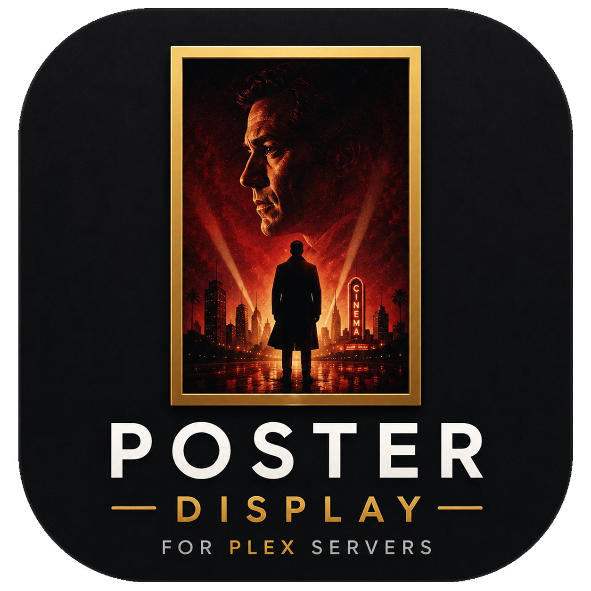

<p align="center">
  
</p>

# Poster Display for Plex

A Roku channel that turns any TV into a beautiful, always-on movie and TV poster display driven by your Plex Media Server. Works on a Roku TV directly or on any television connected to a Roku streaming stick/box. Hang the TV in landscape or mount it vertically — the app rotates content to fit either orientation.

## Why this exists

If you've ever wanted a dedicated "now playing" poster display next to your home theater (or just a rotating digital art frame fed by your own Plex library), today's options are surprisingly limited:

- **[devMikeFrancis/digital-movie-poster](https://github.com/devMikeFrancis/digital-movie-poster)** is a great open-source project, but it requires a dedicated computer or Raspberry Pi wired to the TV.
- **[PosterBox](https://www.posterbox.app/)** is a polished commercial app, but it doesn't run on Roku — leaving every Roku TV owner without a native option.

Most of us already have a Roku stick or a Roku TV sitting in the living room. This project fills that gap: install the channel, point it at your Plex server, and the TV does the rest. No extra hardware, no second device, no PC running in the background. Just the Roku you already own and the Plex library you've already built.

## Features

- **Live poster display** — polls Plex every 15 seconds for the current session and shows the artwork
- **TV episode support** — episodes show the **series poster** as the main image with a small **episode thumbnail** overlay; the status bar reads `Show Name — Episode Title`
- **Content rating icons** — bundled PNG marks for G, PG, PG-13, R, NC-17, XXX, TV-Y, TV-Y7, TV-G, TV-PG, TV-14, TV-MA, and NR. The NR icon is used as the fallback whenever Plex doesn't return a rating; uncommon ratings fall back to a bracketed text badge
- **Release year** sits to the right of the title in the chrome strip, rendered in the same font as the time displays so it reads as a metadata field rather than part of the title
- **Four view modes**, cycling on a single keypress:
  - Landscape Fit / Landscape Fill
  - Portrait Fit / Portrait Fill (for vertically-mounted TVs — content auto-rotates 90°; orientation can be flipped if your TV is mounted the other way)
- **Random Carousel mode** — cycles through random posters from your Plex library every 30 seconds. Manually advance with Fast-Forward, pause auto-advance with Play, exit with Rewind
- **Carousel filtering** — block items from the carousel by content rating (checkbox UI in Settings) or by tagging individual items with a `no-poster` label in Plex
- **Now Playing theater frame** — optional ornate frame around the poster with two bundled styles (Marquee Gold, Theater Silver) selectable from Settings. Add your own PNGs and they're picked up automatically — see [Customization](#customization)
- **Auto-detected frame cutouts** — at startup the app scans each portrait border PNG's alpha channel to find the transparent rectangle, then sizes and places the poster to fit. Drop in a new border PNG with any cutout position and the poster aligns inside it without code changes
- **Portrait poster matte** — optional 60px black gallery-style frame around the portrait poster (no theater-frame variant). The bottom side auto-hides when the info strip is on so it doesn't double up with the chrome
- **Progress bar color picker** — choose from a 12-color palette (Orange, Red, Amber, Yellow, Lime, Green, Teal, Cyan, Blue, Indigo, Purple, Pink). Applies to both landscape and portrait progress fills
- **Blurred ambient backdrop** — landscape view fills the area around the poster with a softly-blurred, dimmed copy of the same artwork (generated server-side by Plex's image transcoder, ~18% opacity)
- **Info overlay** — toggleable chrome strip with rating icon, title, year, live wall clock, and a progress bar showing current and total runtime. Times always read as zero-padded `HH:MM:SS` so the field width stays stable
- **Poster transitions** — pick between `Abrupt`, `Fade`, or `Slide` from the Settings menu; applies to both Carousel advances and Plex playback changes
- **Sign in with Plex (plex.tv/link PIN flow)** — no more copy-pasting tokens. Pick "Sign in with Plex" from Settings; the app shows a 4-character code, you enter it at `plex.tv/link` from any browser, and the app polls Plex.tv until you confirm. It then lists every owned + shared server on your account and lets you pick one
- **GDM server discovery** — auto-detects Plex Media Servers on your LAN during first-time setup so you can pick from a list instead of typing an IP. Stays available as a fallback alongside Sign-in-with-Plex
- **Screensaver suppression** — keeps the screen on indefinitely while the app is running, via a background-thread call to `roAppManager.UpdateLastKeyPressTime` every 30 seconds
- **Persistent settings** — server URL, token, view mode, theater-frame state, info-overlay state, carousel state, blocked ratings, portrait flip, transition style, progress-bar color, portrait-matte state, and portrait-frame style all persist in the Roku registry

## Remote control

| Key | Action |
| --- | --- |
| **Play** / **Up** | Cycle view mode (Landscape Fit → Fill → Portrait Fit → Fill) |
| **Down** | Toggle the Now Playing border on/off |
| **Right** | Toggle info overlay (status text + progress bar + clock) |
| **`*`** (info) / **Left** | Open the Settings menu |
| **Rewind** | Toggle random Carousel mode on/off |

### While Carousel mode is on

| Key | Action |
| --- | --- |
| **Play** / **Pause** | Pause or resume auto-advance (the current poster stays on screen while paused) |
| **Fast-forward** | Jump to the next random poster immediately (works whether playing or paused; if playing, resets the 30-second interval) |
| **Up** | Cycle view mode (Play is repurposed for pause while in Carousel) |
| **Rewind** | Exit Carousel mode |

The on-screen Settings button is normally hidden once your Plex server and token are configured — use **`*`** or the **Left arrow** to open the Settings menu any time.

## Settings menu

Pressing `*` or Left brings up the top-level menu, which has two sub-menus + Close:

### Plex Connection

- **Sign in with Plex** — opens an overlay with a 4-character code and the `plex.tv/link` URL. Open that URL on any phone or computer, sign into Plex if you aren't already, and enter the code. The app polls plex.tv every 3 seconds; once you confirm, it pulls every server on your account (owned + shared) and lets you pick one. Back cancels the flow
- **Change Plex server** — manual fallback: opens GDM discovery; pick from a list of detected servers, enter a URL manually, or cancel
- **Change Plex token** — keyboard prompt for a new Plex token (only needed for unusual setups that don't go through Sign-in-with-Plex)
- **Edit carousel rating filter** — checkbox list of content ratings to exclude from the random Carousel. OK toggles each item, **Back saves and closes**
- **Back** — return to the top-level menu

### Display & Appearance

- **Cycle poster transition** — rotates through `Abrupt` (instant URI swap), `Fade` (~0.6s opacity crossfade through black), `Slide` (~0.8s slide-out / slide-in animation)
- **Change progress bar color** — picker dialog with the 12-color palette; selection persists and applies to both landscape and portrait progress fills
- **Flip portrait orientation** — toggle between CW mount (top of TV on viewer's right) and CCW mount (top of TV on viewer's left). Affects poster rotation and the position of the bottom chrome strip
- **Toggle portrait poster matte** — turn the 60px black gallery frame around the portrait poster on or off. Hidden automatically when the theater frame is on (that PNG provides its own frame)
- **Change portrait frame style** — picker dialog with the bundled portrait theater-frame styles (Marquee Gold, Theater Silver, plus anything else dropped into `images/borders/portrait/`)
- **Back** — return to the top-level menu

Sub-dialogs (server prompt, token prompt, rating filter, color picker, frame style picker) return to the menu that opened them when they close, so you can chain multiple edits in one sitting.

Each option that opens a sub-dialog (server, token, rating filter) returns to the Settings menu when you save or cancel, so you can edit multiple settings in one sitting.

## Initial setup

### Easy path — Sign in with Plex (recommended)

1. Sideload the app to your Roku in Developer Mode (see [Sideloading](#sideloading) below).
2. On first launch, press **OK** on the visible Settings button, then **Plex Connection → Sign in with Plex**.
3. The TV shows a 4-character code and the URL `plex.tv/link`. On any phone or computer, open that URL, sign into Plex if you aren't, enter the code, and tap **Link**.
4. Within a few seconds the app fetches your server list and shows a picker. Choose the server you want this display to use.
5. Start playing something on Plex — within ~15 seconds the poster appears on the Roku.

### Manual path (fallback for unusual networks)

1. From Settings, choose **Plex Connection → Change Plex server** to enter the server URL by hand. The local-network discovery (GDM) runs first and offers any servers it finds; or pick **Enter manually** and type `http://<your-server-ip>:32400`.
2. Choose **Change Plex token** and paste your token. To find it:
   - In the Plex web app, open any item's **Get Info → View XML**
   - Copy the `X-Plex-Token=...` value from the URL
   - Official guide: <https://support.plex.tv/articles/204059436-finding-an-authentication-token-x-plex-token/>

## Hiding posters from the Carousel

The app gives you two independent ways to keep specific posters out of the random Carousel. Use either or both; they're combined with OR.

### 1. By content rating (no Plex Pass needed)

Open the Settings menu (`*` or Left arrow) and choose **Edit carousel rating filter**. A checkbox list appears with the common content ratings:

- **Movies:** G, PG, PG-13, R, NC-17, XXX
- **TV:** TV-Y, TV-Y7, TV-G, TV-PG, TV-14, TV-MA
- **Not Rated** — also catches items that have no rating set at all in Plex

Toggle items with **OK**, then press **Back** to save and close. The carousel cache refreshes immediately. Items whose `contentRating` matches any selection — including the `us/R` prefixed form that some metadata sources use — are excluded from the rotation. Works regardless of whether you have a Plex Pass.

### 2. By per-item label (requires Plex Pass)

For finer-grained control, you can hide individual movies or shows by tagging them in Plex. **This feature requires a Plex Pass** because labels on movies and shows are a Plex Pass feature:

1. In the Plex web app, navigate to the movie or show you want to hide.
2. Click the **edit** (pencil) icon to open the metadata editor.
3. Open the **Tags** tab and add a **Label** with the value:

   ```
   no-poster
   ```

   (Lowercase, with a hyphen.)
4. Save.

The next time the Carousel cache refreshes — toggle Carousel off and on, or relaunch the app — those items are excluded. The label name `no-poster` is hard-coded so no app-side configuration is needed.

## Project structure

```
poster-display-for-plex/
├── manifest                              # Roku channel metadata
├── source/main.brs                       # entry point + screen lifecycle
├── components/
│   ├── PosterDisplayScene.xml/.brs      # main scene UI + interaction
│   ├── PlexSessionTask.xml/.brs         # polls /status/sessions for now-playing
│   ├── PlexLibraryTask.xml/.brs         # fetches library items for the carousel
│   ├── PlexDiscoveryTask.xml/.brs       # GDM UDP broadcast for server discovery
│   ├── PlexAuthTask.xml/.brs            # plex.tv/link PIN flow (request, poll, list servers)
│   ├── BorderCutoutTask.xml/.brs        # scans border PNG alpha channels at startup
│   └── KeepAliveTask.xml/.brs           # suppresses the Roku screensaver
├── images/
│   ├── rokuicon.png                      # 640x360 Roku channel tile + splash
│   ├── logo-square.png                   # square brand icon for the on-screen overlay and README
│   ├── ratings/                          # PNG icons per content rating (G, PG, ..., NR)
│   └── borders/
│       ├── landscape/landscape-border-01.png
│       └── portrait/portrait-border-01.png  (Marquee Gold)
│       └── portrait/portrait-border-02.png  (Theater Silver)
├── fonts/
│   ├── Oswald-Bold.ttf                  # chrome text (titles, prefix, messages, settings glyph)
│   ├── Oswald-Medium.ttf                # available for lighter chrome weights if needed
│   ├── BebasNeue-Regular.ttf            # clock + progress bar time displays (numbers only)
│   └── RetroSigned-DYYY0.ttf            # marquee title font inside the Now Playing border
└── package.sh                            # builds poster-display-for-plex.zip for sideloading
```

## Architecture notes

- **All network I/O runs on Task threads.** `roUrlTransfer` cannot be created on the SceneGraph render thread; the scene observes `result` fields on the Tasks and reacts when they update.
- **Plex.tv sign-in uses the standard PIN flow.** `PlexAuthTask` exposes three modes (`requestPin`, `pollPin`, `listServers`) against `plex.tv/api/v2`. Each request carries a persistent `X-Plex-Client-Identifier` generated once per install via `roDeviceInfo.GetRandomUUID()` and stored in the registry — Plex.tv treats reused identifiers as the same device, so polls correctly resolve to the user's just-entered PIN. When listing servers, the task prefers a local `http://` connection over a remote `https://` one for speed.
- **Screensaver suppression also runs on a Task thread** for the same reason — `roAppManager` is a MAIN/TASK-only component.
- **Two rendering paths per view mode:** with-theater-frame and without. The framed variants size the poster to fit precisely inside the PNG's transparent cutout — and the cutout itself is measured at runtime by `BorderCutoutTask`, not hardcoded, so any new border PNG works without code changes.
- **Runtime alpha-cutout detection** uses `roBitmap.GetByteArray` on each border PNG at startup, scanning the alpha channel edge-by-edge (top → bottom → left → right) to find the bounding box of `alpha < 16` pixels. The scene then computes the poster's fit/fill width, height, pivot, and translation so the rotated portrait poster lands centered inside the cutout. Falls back to baked geometry if `roBitmap` isn't available on the device.
- **Chrome (status bar, progress, Settings) has separate landscape and portrait layouts.** The portrait layout sits in a `Group` with `rotation = ±π/2` (sign depends on the user's mount direction) so it appears correctly oriented for a vertically-mounted TV. Inside the strip, the progress row + title row are vertically centered as a group with even spacing above, between, and below. The portrait poster shrinks slightly in portrait when info is on to leave room for the chrome strip below it.
- **Portrait poster matte** is rendered as four separate Rectangle strips inside a Group sharing the poster's rotation + center, so each side can be individually hidden — the viewer-bottom strip hides whenever info is on so the chrome strip below the poster doesn't double up with a redundant matte band.
- **Poster transitions** use Roku's `Animation` node. Fade interpolates the `opacity` field on the poster (and ambient backdrop); slide interpolates the `translation` field. The URI swap happens in the BRS handler between the "out" and "in" animations so the new image is in place before the fade-in / slide-in begins.
- **Year label positioning** is dynamic. After the title label re-renders, its `boundingRect` field updates; the scene observes that field and snaps the year label to the right edge of the title text so the gap stays consistent regardless of title length. Falls back to a text-length × average-char-width estimate when `boundingRect` isn't usable (on some Roku firmwares the field is unreliable on first paint).
- **Carousel cache lives in memory** for the app session. New Plex content won't appear in the rotation until the carousel cache is rebuilt (toggle Carousel off and on, change a filter setting, or relaunch the app).

## Sideloading

1. Enable **Developer Mode** on your Roku and note the device IP (Settings → System → About).
2. From your Mac in this project folder:
   ```sh
   ./package.sh
   ```
   This produces `poster-display-for-plex.zip`.
3. Open `http://<roku-ip>` in your browser, sign in with your developer credentials, and upload the ZIP via the **Upload** button.
4. The app appears on your Roku home screen as "Poster Display for Plex".

### Debugging

Connect to the Roku's BrightScript console for live output:

```sh
nc <roku-ip> 8085
```

(`nc` ships with macOS; `telnet` was removed in recent versions.)

## Packaging for distribution

This project's `package.sh` produces an **unsigned source bundle** for sideloading only. To upload to the Roku Channel Store, you need to generate a **signed `.pkg`** from your developer-enabled Roku device using its built-in Packager utility. The Roku store will reject a raw source ZIP.

## Customization

- **Theater frame art** lives in `images/borders/`. Each PNG must be 1920×1080 RGBA with the poster area marked by `alpha = 0`. At startup the app runs `BorderCutoutTask` against every portrait border PNG, scans the alpha channel to find the transparent rectangle, and recomputes the poster's fit/fill geometry from the measured cutout — so adding a new portrait frame is just dropping a PNG in `images/borders/portrait/` and registering it in the `m.portraitBorderStyles` array (id, display name, URI). Fallback fit/fill values in the same array are used if detection fails on a particular device.
- **Progress bar colors.** The 12-color palette is the `m.progressColors` array in `PosterDisplayScene.brs` (name + ARGB hex per entry). Add or rename entries freely; the picker dialog rebuilds from this array. Existing saved indices that fall outside the new range reset to 0.
- **Portrait matte thickness** defaults to 60px and is the `thickness` local in `applyPortraitPosterBorder()`. Increase for a bolder gallery look; decrease for a thinner frame.
- **Fonts** live in `fonts/` and are referenced by path in `PosterDisplayScene.xml`. Drop in another `.ttf` and swap the `uri` to change the chrome typography or the marquee font.
- **Rating icons.** Drop a new PNG into `images/ratings/` (square or 3:2 wide, depending on rating shape) and add the lookup branch in `getRatingIcon()` returning `{ uri, aspect }`. The chrome scales the icon by aspect ratio so it lines up with the title.
- **Poll interval** for the live Plex session is set on the `pollTimer` node (`duration` in seconds). Default is 15 seconds.
- **Carousel interval** is set on the `carouselTimer` node — default 30 seconds.
- **Transition durations** are set on the `posterFadeOut` / `posterFadeIn` / `posterSlideOut` / `posterSlideIn` Animation nodes — defaults are 0.3s for fade and 0.4s for slide (per direction).
- **Blurred backdrop opacity** is the `opacity` attribute on the `backgroundPoster` node in the scene XML — default `0.18`.
